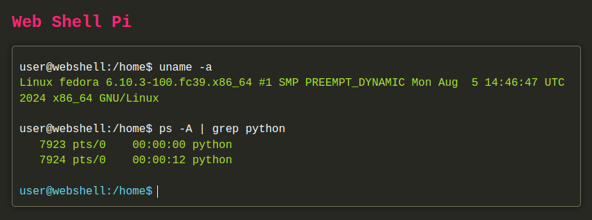

# Web Shell Pi



**Web Shell Pi** is a web-based shell interface built using Flask. It provides a terminal-like environment in your browser, allowing you to execute shell commands, navigate directories, and interact with your filesystem just like in a traditional terminal. It offers customizable features such as command history, output coloring, and configurable console height.

## Features

- **Command Execution:** Run shell commands directly from your browser.
- **Directory Navigation:** Change directories and navigate through the filesystem.
- **Command History:** Access previous commands using the up and down arrow keys.
- **Output Coloring:** Colored output for success, errors, and warnings.
- **Adjustable Console Height:** Set a fixed or dynamic height for the console area.

## Installation

To get started with Web Shell Pi, follow these steps:

1. **Clone the repository:**

    ```bash
    git clone https://github.com/yourusername/web-shell-pi.git
    ```

2. **Navigate to the project directory:**

    ```bash
    cd web-shell-pi
    ```

3. **Create and activate a virtual environment:**

    ```bash
    python -m venv venv
    source venv/bin/activate  # On Windows use `venv\Scripts\activate`
    ```

4. **Install the required packages:**

    ```bash
    pip install -r requirements.txt
    ```

5. **Run the Flask application:**

    ```bash
    python app.py
    ```

6. **Open your browser and go to `http://127.0.0.1:5000/` to access the terminal.**

## Configuration

You can customize the Web Shell Pi application by modifying the parameters in `app.py`:

- **`console_height`**: Set the height of the console area in pixels.
- **`fixed_height`**: Set to `True` to have a fixed-height console with scrolling, or `False` to allow dynamic resizing.

Example:

```python
web_shell_app = WebShellApp(console_height=300, fixed_height=False)
```

## Usage

- **Enter Commands:** Type your shell commands into the input field and press Enter to execute.
- **Navigate Directories:** Use `cd <directory>` to change the current directory.
- **View Command Output:** The output of your commands will be displayed in the terminal area.

## Contributing

Feel free to contribute to Web Shell Pi by submitting pull requests or opening issues. We welcome contributions that enhance the functionality, fix bugs, or improve the overall user experience.

## License

This project is licensed under the MIT License. See the [LICENSE](LICENSE) file for more details.


